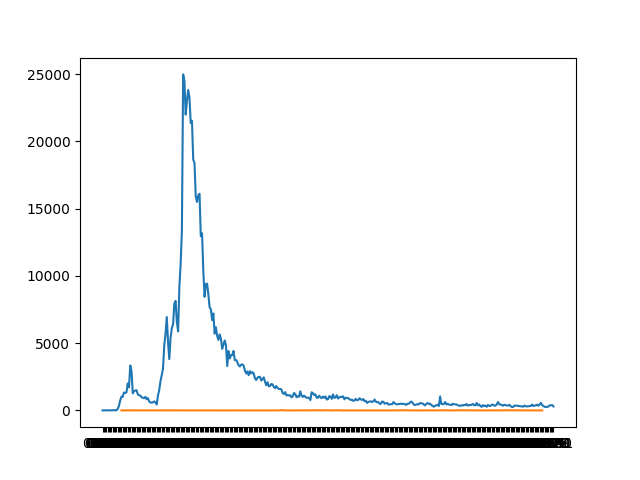

In this project, we analyzed the contents of geotagged Twitter data files throughout 22020. Using shell scripts and python files, we reduced the data into separate files sorted by language and country. 

The visualize file generated four plots between two hashtags '#coronavirus' and '#코로나바이러스' depending on language and country for a total of four plots.

'#coronavirus', sorted by country

'#coronavirus', sorted by language

'#코로나바이러스', sorted by country

'#코로나바이러스', sorted by language

Additionally, we wrote an alternative reduce file to create line plots of the number of tweets under input hashtag "keys" by days in the year. Underneath is a line plot of the two hashtags, '#코로나바이러스' and 'coronavirus', we've looked at previously depicted over the year. (Note that the '#코로나바이러스' line appears to be almost 0 because the tweets in the hashtag were much lower in number relative to #coronavirus)

